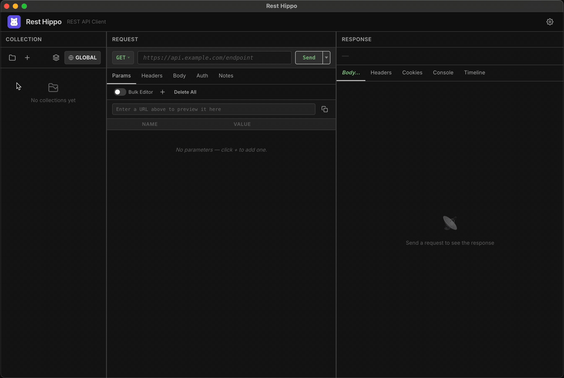

# Rest Hippo — A free, offline, open-source REST API client

[](https://github.com/jfigge/resthippo/actions/workflows/ci.yml)
[](LICENSE)

[](https://github.com/jfigge/resthippo/stargazers)

A lightweight, cross-platform desktop API client — a **Postman / Insomnia
alternative** that runs entirely on your machine. **No account, no telemetry, no
cloud** — just install it and send a request. Built with **Electron** and
**Vanilla JavaScript**, backed by a file-based **Node.js storage layer**, with all
HTTP running natively in the main process so requests are never subject to browser
CORS.

> **Why Rest Hippo?** Free forever · Open source (Apache 2.0) · 100% offline · No
> sign-in · No tracking · Your collections stay in local files.
> [See how it compares →](https://resthippo.com/vs-postman.html)

<p align="center"></p>

📦 **[Download for macOS, Windows &amp; Linux](https://resthippo.com/#downloads)** &nbsp;·&nbsp;
🌐 **[resthippo.com](https://resthippo.com)**

## Features

- **Requests** — every HTTP method (and custom verbs), headers, query and path
  params, and rich body editors (JSON, form-url-encoded, multipart with file
  upload, raw, and binary).
- **GraphQL** — a dedicated query/variables editor with schema introspection,
  validation, and a browsable schema viewer.
- **Realtime** — a WebSocket console and live **Server-Sent Events** /
  chunked-streaming response rendering.
- **Response viewer** — pretty-printing with syntax highlighting (Prism.js),
  hex view for binary payloads, in-body search, a **jq / yq / XPath** body
  filter, and a request **timing waterfall**. Post-response **captures** pull
  values from the body, headers, or status straight into variables.
- **Scripting** — sandboxed **pre-request** and **after-response** JavaScript
  hooks with a small `hippo.*` API to read and mutate the request, variables,
  and environment; runs isolated from the filesystem and network.
- **Authentication** — API Key, Basic, Bearer, Digest, NTLM, and AWS SigV4 /
  OAuth 1.0a request signing, plus a full **OAuth 2.0 / OIDC** implementation:
  Authorization Code (PKCE), Implicit, Client Credentials, Resource Owner
  Password, **Device Authorization** (RFC 8628), and **Token Exchange**
  (RFC 8693), with OIDC discovery and token caching.
- **mTLS** — per-host client certificates and TLS-verification overrides.
- **Cookie jar** — persistent, per-domain cookie storage.
- **Environments & variables** — global / collection / environment scopes,
  `{{variable}}` resolution with an inline typeahead, built-in dynamic functions
  (`uuid`, `now`, `randomInt`, `hash`, `hmac`, …), allow-listed OS-environment
  access (`environmentVariable("RESTHIPPO_…")`), and secrets that are
  **encrypted at rest**.
- **Import / export** — import from **Postman**, **Insomnia**, **OpenAPI 3 /
  Swagger 2**, **HAR**, and **cURL**; redaction-aware export back to Postman,
  Insomnia, OpenAPI, and HAR; plus full-workspace backup & restore.
- **Code generation** — copy any request as a snippet (cURL, `fetch`, Python
  `requests`, Go, HTTPie).
- **Networking** — configurable HTTP / SOCKS5 proxy with request-retry policy
  and per-host network overrides.
- **Productivity** — favorites & recents, and an in-app user guide
  (Help → User Guide).
- **Themes, typography & i18n** — a theme editor, a user-selectable UI font
  (Inter bundled as a variable font; no CDN fonts), and a UI localized into
  seven languages (English, German, Spanish, French, Italian, Japanese, and
  Simplified Chinese).

## Architecture

```
Electron main process (src/app/main.js)        ← owns all filesystem I/O + native HTTP
  └── IPC bridge (src/app/preload.js)  →  window.hippo.*
        └── Renderer / UI (src/web/scripts/app.js)   ← sandboxed; talks to main via IPC only
              ├── TreeView
              ├── RequestEditor
              └── ResponseViewer
```

The main process performs all HTTP execution natively, so requests are **not**
subject to browser CORS constraints. The renderer is sandboxed and communicates
with the main process exclusively through the `window.hippo.*` bridge. Storage is
file-based under Electron's `userData` path (see `src/app/store/`).

## Prerequisites

- [Node.js](https://nodejs.org/) (includes `npm`) — Electron 42 bundles Node 22;
  matching that locally keeps CI parity.
- *(optional)* [Go](https://go.dev/) — only needed to run the mock test server.
- *(optional)* [Docker](https://www.docker.com/) — only needed for the bundled
  Keycloak OAuth test environment.

## Project Structure

```
Rest Hippo/
├── Makefile               # Build orchestration (authoritative command list)
├── mock/                  # Optional Go mock API for MIME / status / auth testing
└── src/
    ├── package.json       # Node / Electron dependencies + electron-builder config
    ├── app/               # Electron main process (Node.js)
    │   ├── main.js        #   window lifecycle + IPC registration
    │   ├── preload.js     #   IPC bridge exposed as window.hippo
    │   ├── store/         #   file-based storage layer (+ tests)
    │   ├── net/           #   native HTTP, TLS/mTLS, SSE streaming
    │   ├── scripting/     #   sandboxed pre-request / after-response scripts
    │   └── auth/          #   Digest / NTLM / SigV4 / OAuth 1.0a signing (+ tests)
    └── web/               # Renderer (Vanilla JS + CSS)
        ├── index.html
        ├── docs/          #   shipped in-app user guide (Markdown)
        ├── locales/       #   i18n catalogs (7 languages)
        ├── scripts/       #   UI components, OAuth, import/export, vendored libs
        ├── styles/        #   CSS + design tokens (theme.css)
        └── fonts/         #   Bundled Inter variable font
```

## Getting Started

### Install dependencies

```bash
make install        # npm ci in src/
```

### Run in development

```bash
make debug          # Electron with DevTools + hot-reload (primary dev workflow)
```

This launches the Electron app directly with a local `--user-data-dir` so
development data stays out of your real profile.

## Building

For day-to-day local builds, `make` with no arguments produces an **unsigned,
un-notarized** macOS `.dmg` — fast, and it needs no signing credentials. Use the
`sign` targets when you want a shippable, signed + notarized artifact. Output
lands in `build/src/dist/`.

```bash
make                # Unsigned macOS .dmg (default; fast local testing)
make dmg            # Unsigned macOS .dmg (same as bare `make`)
make all            # Unsigned installers for all platforms
make sign-dmg       # Signed + notarized macOS .dmg (ready to ship)
make sign-all       # Signed installers for all platforms
```

`build-*` targets produce an **unpackaged** app directory (fastest, for smoke
tests — always unsigned). `dist-*` targets produce **installers** (signed when
credentials are present).

```bash
make build          # Build the app directory for macOS (dir only)
make build-mac      # macOS app directory
make build-linux    # Linux app directory
make build-win      # Windows app directory

make dist           # Installers for all platforms (host can only build its own)
make dist-mac       # macOS (.dmg, .zip)
make dist-linux     # Linux (.AppImage, .deb)
make dist-win       # Windows (NSIS .exe, portable)

make launch         # Build and open the macOS app
```

> A given host can only build its own platform's installer (a macOS `.dmg`
> needs macOS, etc.). CI runs `dist-mac` / `dist-linux` / `dist-win` on native
> runners.

### Code signing & notarization

`dist-mac` / `dist-win` sign their installers when signing credentials are
present and produce **unsigned** artifacts (no failure) when they are absent —
so unsigned `--dir` dev builds and credential-less CI keep working unchanged.

- **macOS** builds run under the hardened runtime with the entitlements in
  `src/packaging/entitlements.mac.plist`, are signed with a **Developer ID
  Application** identity, and are **notarized + stapled** via Apple's
  `notarytool`. A signed, notarized `.dmg` passes Gatekeeper (`spctl -a`).
- **Windows** installers are **Authenticode**-signed (SHA-256, RFC-3161
  timestamped), which clears SmartScreen on a clean machine.

For a signed build **locally**, copy `release.env.example` → `release.env`
(git-ignored) and fill in the credentials; `make dist-*` reads them
automatically. In **CI** the same values come from repository secrets — the
[Release workflow](.github/workflows/release.yml) lists the exact secret names
and signs only on tag/release builds (PR builds stay unsigned `--dir`).

Verify the artifacts:

```bash
codesign --verify --deep --strict --verbose=2 <Rest Hippo.app>   # macOS
spctl -a -vvv -t install <Rest Hippo.app>                         # macOS Gatekeeper
signtool verify /pa /v <resthippo-setup.exe>                     # Windows
```

## Code Quality & Tests

```bash
make fmt            # Format JS/CSS/HTML (Prettier)
make fmt-check      # Verify formatting without writing
make lint           # Lint JS (ESLint)
make test           # Run the full unit/integration suite (node --test)
make test-e2e       # UI end-to-end suite — drives the real app over CDP
```

`make test` is hermetic — pure `node --test` units with no display, Electron
process, or network — and is the gate that CI and the pre-commit hook enforce.
`make test-e2e` is **separate and not part of `make test`**: it launches the
real Electron app and drives it the way a user would over the Chrome DevTools
Protocol (no Playwright/Puppeteer) against the Go mock API, so it needs a
display. Pass `NAMES="send graphql"` to run a subset.

## Releasing

Run from `main` with a clean, up-to-date working tree:

```bash
make release VERSION=1.2.3
```

It validates the version, confirms you're on `main` and in sync with origin,
then gates on the full test suite. On approval it bumps `src/package.json`,
fast-forwards the long-lived `release` branch to `main`, tags `v1.2.3`, and
pushes `main` + `release` + the tag atomically. The tag push triggers the
**Release** workflow to build and publish installers for all platforms.

`release` stays a strict fast-forward of `main`, so it always points at exactly
what was last shipped — a clean base for a hotfix if one is ever needed. Bump
`src/package.json` is handled for you, so the tag and the installer version
always match.

## Vendored Libraries

Third-party browser libraries are bundled into `src/web/scripts/vendor/` via
esbuild rather than loaded from a CDN:

```bash
make vendor-yaml        # yaml
make vendor-prism       # Prism.js (syntax highlighting)
make vendor-markdown    # marked + DOMPurify
make vendor-graphql     # graphql (introspection + validation)
make vendor-jq          # jqjs (response body filtering)
```

## Test Helpers

### Mock API server (Go)

A small Go server exposing endpoints for MIME-type, status-code, and auth
testing on `http://localhost:8888`:

```bash
make mock-up        # build + start
make mock-down      # stop
```

The mock server also exposes an `/echo` endpoint for any HTTP method (including
custom verbs): `http://localhost:8888/echo` reflects the request back — method,
URL, query params, headers, cookies and body. The response is JSON by default,
or XML/YAML/HTML when the `Accept` header asks for one of those
(`application/xml`, `application/yaml`, `text/html`).

For testing loading states, the timing waterfall and timeout/cancel handling it
exposes `GET /delay?seconds=<n>`, which sleeps for `n` seconds (clamped to
`1`–`30`) before returning JSON. A missing or non-integer `seconds` returns
`400`.

For the WebSocket client it exposes `ws://localhost:8888/ws` (and `/ws/echo`),
which echoes every frame back; `/ws/time`, which pushes a timestamped JSON frame
once per second (to test received-without-send traffic); and `/ws/reject`, which
refuses the upgrade with `401` so handshake-failure handling can be exercised.

For GraphQL it serves `POST /graphql` (introspection plus `user` / `users` /
`createUser` operations). For streaming responses it exposes `GET /sse` (an
index) with `/sse/events`, `/sse/counter`, `/sse/llm`, and `/sse/infinite`
emitting live **Server-Sent Events**, and `GET /ndjson` for chunked NDJSON
(enable the request's **Stream** toggle to watch either render incrementally).

It also runs a forward proxy on `http://localhost:9999` and a **SOCKS5** proxy
on `localhost:9998` for exercising Rest Hippo's proxy settings and request-retry
policy. Point a request's proxy at one and send the `X-Proxy-Error` header to
make the forward proxy fail a fixed number of times before the request succeeds
— `X-Proxy-Error: 3` returns `503` for the first two attempts of a given URL,
then forwards the third upstream (append `:timeout`, `:reset`, or a status code
to vary the failure mode, e.g. `X-Proxy-Error: 2:timeout`). The countdown is
cached per URL for 5 minutes and resets once the request finally succeeds, so a
retry policy can be observed driving the request to completion. Set
`MOCK_PROXY_USER` / `MOCK_PROXY_PASS` to require proxy authentication (Basic on
the forward proxy, RFC 1929 on SOCKS5).

### Keycloak OAuth environment (Docker)

Spins up a Keycloak instance pre-configured with realms, users, and clients for
each OAuth grant type (Authorization Code, PKCE, Client Credentials, Implicit,
Password, Device Authorization, and Token Exchange):

```bash
make kc             # start + bootstrap + print credentials
make kc_creds       # print endpoints, clients, and sample curl requests
make kc_stop        # stop and remove the container
make kc_reset       # stop and delete data volumes
```

## Build Information

```bash
make version        # Print the current version string
make info           # Print full build info (version, branch, commit, build time)
make help           # List all available targets
```

## Clean

```bash
make clean          # Remove build/ and dist/ directories
```

## Contributing

Contributions are welcome! Rest Hippo uses the
[Developer Certificate of Origin](DCO) (DCO): every commit must be signed off
with `git commit -s`, certifying you wrote the patch or have the right to submit
it under the project's license. New source files should carry the standard
Apache 2.0 header. See [`CONTRIBUTING.md`](CONTRIBUTING.md) for the full
workflow.

## License

Copyright © 2026 Jason Figge.

Licensed under the [Apache License, Version 2.0](LICENSE). You may obtain a copy
of the License in the [`LICENSE`](LICENSE) file or at
<http://www.apache.org/licenses/LICENSE-2.0>. Unless required by applicable law
or agreed to in writing, software distributed under the License is distributed
on an "AS IS" BASIS, WITHOUT WARRANTIES OR CONDITIONS OF ANY KIND. See
[`NOTICE`](NOTICE) for attribution details.
