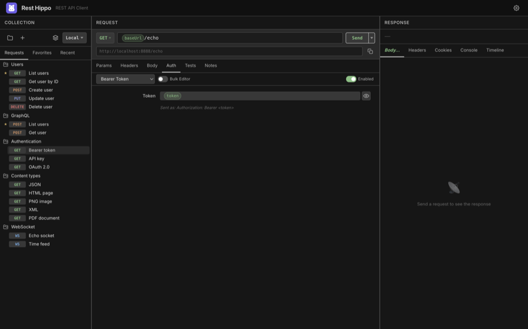
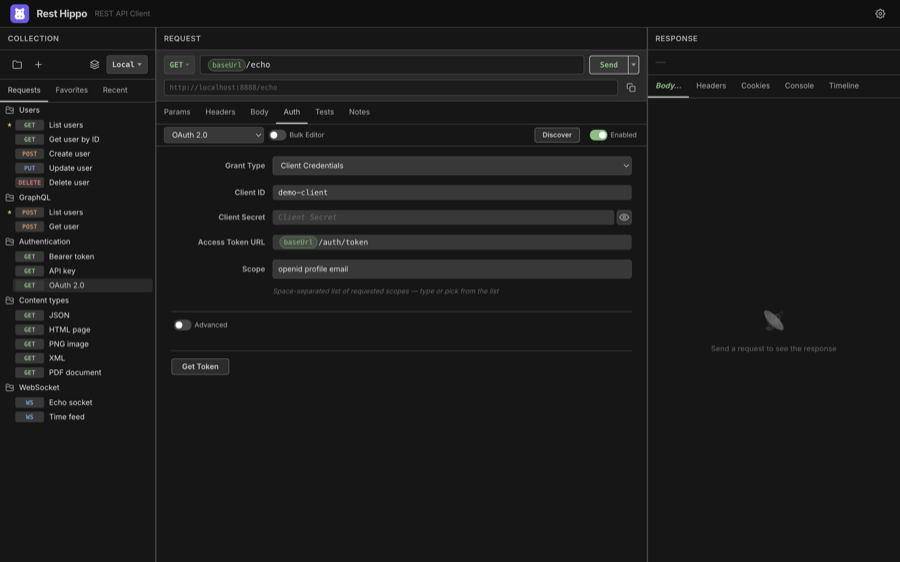

# Authentication

[← Back to contents](README.md)

The **Auth** tab attaches credentials to a request. Pick a type from the
dropdown and fill in the fields — wurl applies the right header (or query
parameter) automatically when you send. Use the **Enabled** toggle to turn auth
on or off without losing the settings.

Every secret field (passwords, tokens, client secrets, keys) is **masked** with
a reveal toggle and is **encrypted at rest**, so credentials never sit in plain
text on disk. All fields accept [`{{variables}}`](variables-and-environments.md),
so you can keep secrets in a secure environment variable and reference them here.

## Types at a glance

| Type             | What it sends                                                      |
| ---------------- | ------------------------------------------------------------------ |
| **None**         | No credentials                                                     |
| **API Key**      | A key as a header or query parameter                               |
| **Basic**        | `Authorization: Basic …` (username:password, base64-encoded)       |
| **Bearer Token** | `Authorization: Bearer <token>`                                    |
| **Digest**       | RFC 2617/7616 challenge-response (handles the 401 round-trip)      |
| **NTLM**         | Microsoft NTLM handshake (username, password, domain, workstation) |
| **AWS IAM**      | AWS Signature V4 signing (access key, secret, region, service)     |
| **OAuth 1.0**    | OAuth 1.0a request signing (`Authorization: OAuth …`)              |
| **OAuth 2.0**    | A full OAuth 2.0 / OIDC flow (see below)                           |

### API Key

Enter a **key name** and **value**, and choose whether to add it to the
**Header** or the **Query Param**. wurl suggests common key names as you type.

### Basic

Enter a **username** and **password**. wurl base64-encodes them into the
`Authorization` header.

### Bearer Token

Enter a **token**. wurl sends `Authorization: Bearer <token>`. The tip line under
the field shows exactly what will be sent.

### Digest & NTLM

For **Digest**, supply a username and password; wurl performs the
challenge-response handshake (including the initial 401) for you. **NTLM** adds
optional **domain** and **workstation** fields for the multi-leg Windows
handshake.

### AWS IAM (SigV4)

Sign requests with **Signature Version 4**: enter your **Access Key ID**,
**Secret Access Key**, **Region**, and **Service** (wurl can infer the service
from the host), plus an optional **Session Token**. The signature, date, and
signed-headers are computed at send time.

### OAuth 1.0a

For legacy APIs that still use **OAuth 1.0a**, enter your **Consumer Key** and
**Consumer Secret**, and (for an access token) the **Token** and **Token
Secret**. Choose a **Signature Method** — **HMAC-SHA1** (the most common),
**HMAC-SHA256**, or **PLAINTEXT** — and optionally a **Realm**. wurl signs the
request at send time, computing the signature over the method, URL, and
parameters and adding the `Authorization: OAuth …` header; the `oauth_nonce` and
`oauth_timestamp` are generated automatically for each request.

## OAuth 2.0

The OAuth 2.0 type supports the full set of grant types and OIDC discovery:

1. **Grant Type** — choose Authorization Code, Implicit, Client Credentials,
   Resource Owner Password, **Device Authorization**, or **Token Exchange**.
2. Fill in **Client ID**, **Client Secret** (for confidential clients), the
   **Authorization URL** and **Access Token URL**, and the **Scope** (with
   autocomplete for common scopes like `openid`, `profile`, `email`).
3. Click **Get Token**. For browser-based flows (Authorization Code, Implicit),
   wurl opens a popup window for you to log in, intercepts the redirect, and
   exchanges the code for an access token. The token is then attached to your
   request.

**Device Authorization** (RFC 8628) — for input-constrained or headless
clients. Provide the **Device Authorization URL**, **Access Token URL**, and
**Client ID**, then click **Get Token**: wurl shows a **user code** and a
**verification URL** to open on another device, and polls in the background until
you approve (handling the standard `authorization_pending` / `slow_down`
back-off) or the code expires.

**Token Exchange** (RFC 8693) — swap one token for another. Provide the
**Subject Token** and its **Subject Token Type**, and optionally an **Actor
Token** (for delegation), **Requested Token Type**, **Audience**, and
**Resource**. The exchanged token is cached like any other grant.

**OIDC Discovery** — click **Discover** to fetch a provider's
`.well-known/openid-configuration` and auto-populate the authorization and token
URLs and the available scopes.

**Advanced** — expand the **Advanced** section for fine control over
**Response Type**, **State**, where credentials go (`header` vs `body`),
**Audience**, **Resource**, **Origin**, and a custom **Header Prefix**.

> Authorization Code flows use **PKCE** by default for public clients, so you can
> authenticate against modern providers without embedding a client secret.

---

Next: [Variables & Environments →](variables-and-environments.md)
