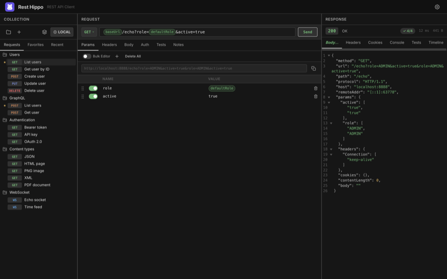
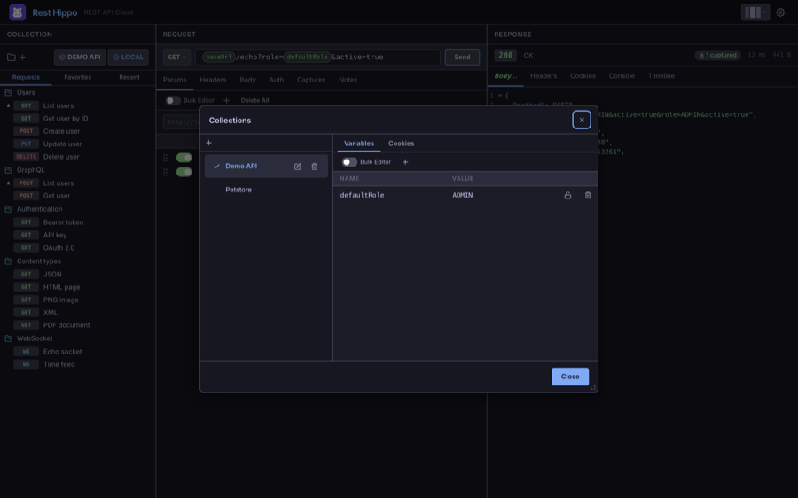
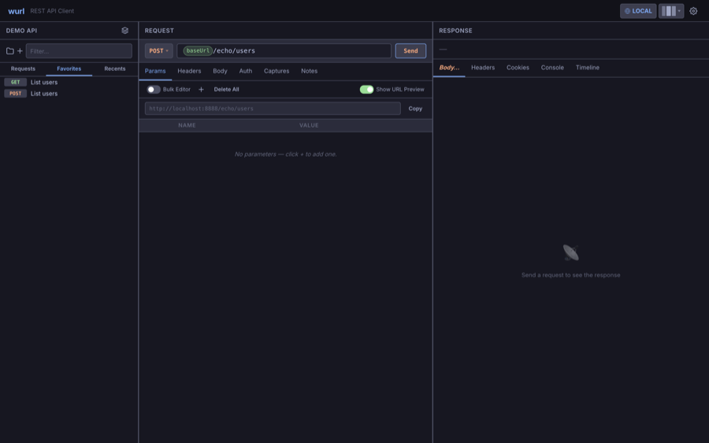
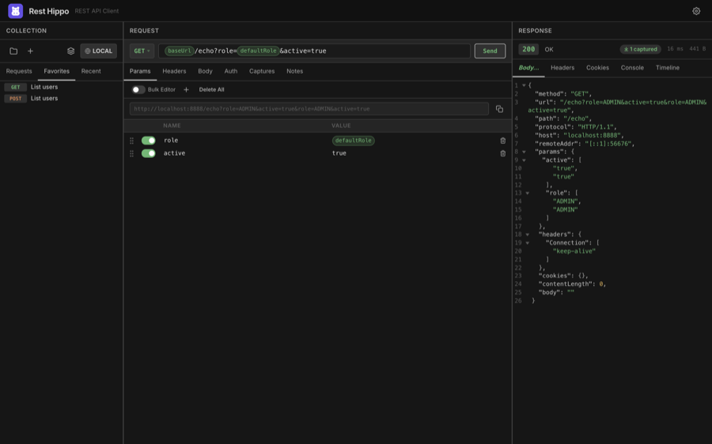

# Collections & the Tree

[← Back to contents](README.md)

The left panel is where your requests live. wurl organizes them into
**collections** (top-level groups) containing **folders** and **requests**,
nested as deeply as you like.

## Collections

A **collection** is a self-contained group of requests with its own
[variables](variables-and-environments.md#collection-variables) and an optional
[cookie jar](#cookies). The name of the active collection is shown at the top of
the panel (e.g. **Demo API**).

Open the **Collections** manager (the stacked-layers icon at the top of the
panel) to create, rename, switch, and delete collections:

- **+** — create a new, empty collection.
- Click a collection row to **make it active**; a check marks the active one.
- The pencil and trash icons (or a double-click on the name) **rename** and
  **delete** a collection. Deletes ask for confirmation.
- The **Variables** and **Cookies** tabs on the right edit that collection's
  variables and stored cookies.

## Folders and requests

Inside a collection you build a tree of folders and requests:

- **New Request** — the **+** button above the tree, or right-click a folder →
  **Add Request**.
- **New Folder** — right-click a collection or folder → **Add Folder**.
- **New WebSocket Request** — right-click a folder → **Add WebSocket Request**,
  or right-click the **+** button above the tree and choose
  **Add WebSocket Request** (see [WebSockets](websocket.md)).
- **Reorder / re-nest** — drag a request or folder to move it; a placeholder
  shows where it will land.
- **Rename** — double-click the name (or right-click → **Rename**).
  <kbd>Enter</kbd> confirms, <kbd>Esc</kbd> cancels.
- **Filter** — type in the search box at the top to filter requests by name.

Each request shows a colored **method badge** (GET, POST, PUT, DELETE, …). You
can switch these badges to compact icons in
[Settings → Appearance](settings-and-themes.md#appearance).

### The right-click menu

Right-clicking a request or folder opens a context menu with the most common
actions:

| Action                                                       | Applies to           | What it does                                                   |
| ------------------------------------------------------------ | -------------------- | -------------------------------------------------------------- |
| **Add Request** / **Add WebSocket Request** / **Add Folder** | folders              | Create a child item                                            |
| **Rename**                                                   | both                 | Edit the name inline                                           |
| **Favorite** / **Unfavorite**                                | requests             | Toggle the [Favorites](#favorites-and-recents) star            |
| **Duplicate**                                                | both                 | Copy the item (and its contents)                               |
| **Generate cURL**                                            | requests             | Copy an equivalent `curl` command to the clipboard             |
| **Export…**                                                  | collections          | [Export](import-export-and-backup.md) the collection           |
| **Variables**                                                | collections, folders | Edit [variables](variables-and-environments.md) for that scope |
| **Clear Run History**                                        | requests             | Discard the request's saved [timeline](responses.md#timeline)  |
| **Delete**                                                   | both                 | Remove the item (asks to confirm)                              |

## Favorites and Recents

Two extra tabs sit above the tree and span **all** your collections:

**Favorites** — requests you've starred for quick access. Star a request from
its right-click menu, then drag to reorder them.

**Recents** — the requests you've used most recently, newest first. This list is
maintained automatically.

> Prefer not to see Recents? Turn off **Show recents** in
> [Settings → Appearance](settings-and-themes.md#appearance).

## Cookies

Each collection has its own **cookie jar**. When **Send cookies** is enabled for
a collection, cookies returned by responses are stored and automatically
attached to matching later requests in that collection. Manage the jar from the
**Cookies** tab in the Collections manager, and inspect cookies a response set
on the [Cookies tab](responses.md#cookies) of the response viewer.

---

Next: [Building Requests →](requests.md)
