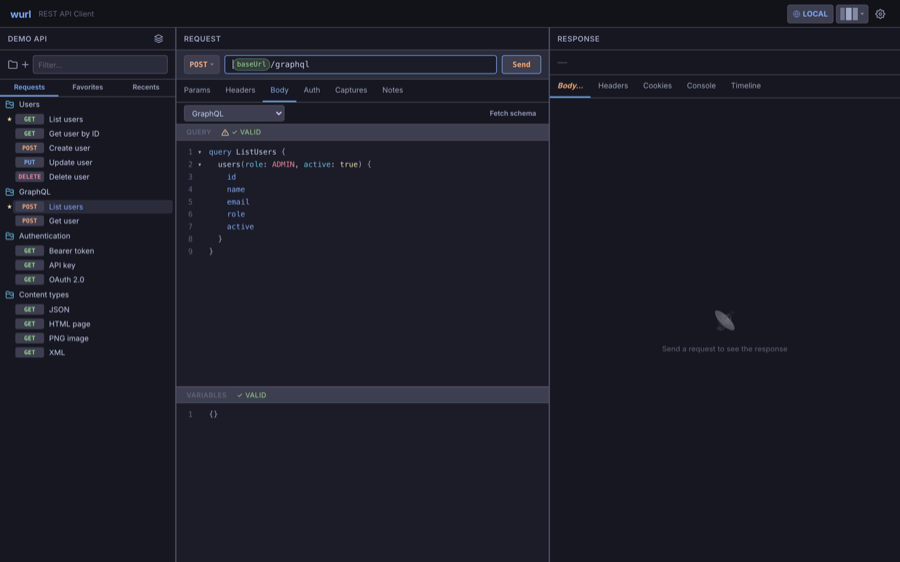
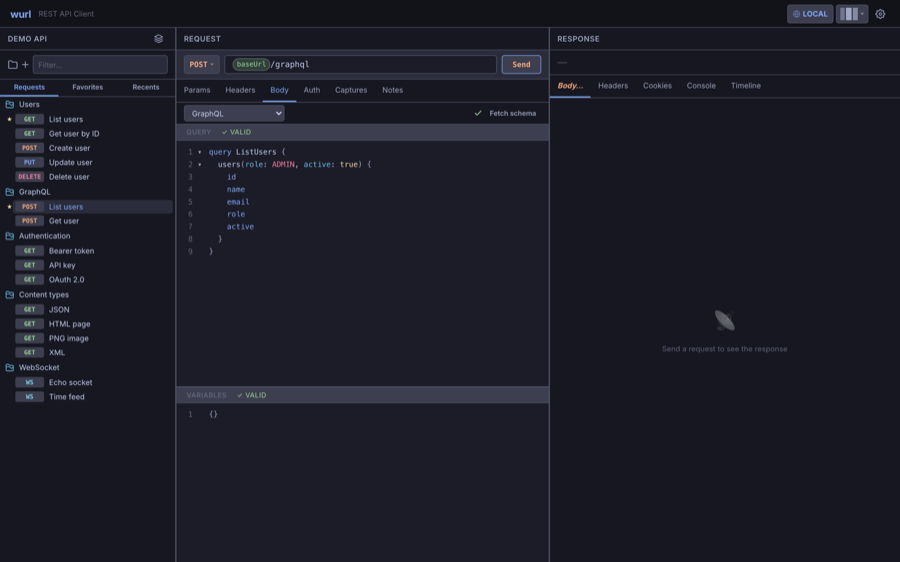
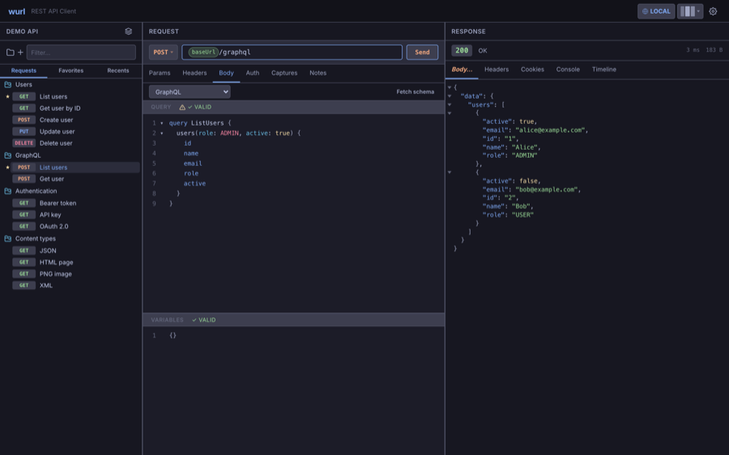

# GraphQL

[← Back to contents](README.md)

wurl has a first-class GraphQL editor. Set a request's **method** to `POST`,
point the URL at your GraphQL endpoint, and choose **GraphQL** as the
[body type](requests.md#request-body).

## The query editor

The Body tab splits into two panes: the **Query** editor and a **Variables**
editor for the operation's JSON variables.

- Both panes are syntax-highlighted with line numbers and
  [code folding](settings-and-themes.md#appearance).
- The **Query** pane shows a **✓ VALID / ✗** badge for syntax (and, once a
  schema is fetched, for validity against the schema).
- The **Variables** pane validates that your variables are well-formed JSON.
- The split orientation follows the app [layout](settings-and-themes.md#layouts):
  side-by-side panes in wide layouts, stacked panes in tall ones. Drag the
  divider to resize.

You can use [`{{variables}}`](variables-and-environments.md) in the query and
variables, the same as any other body.

## Fetching the schema

Click **Fetch schema** to run a GraphQL **introspection** query against the
request's URL. Once the schema loads, wurl uses it for two things:

1. **Autocomplete** — typing in the Query pane suggests fields, arguments,
   types, and enum values from your schema.
2. **Validation** — the **✓ VALID** badge now reflects whether your query is
   valid _against the schema_, not just syntactically.

After a schema is loaded, the status badge shows how many types are available.
**Right-click** the badge to **View Schema** (a read-only, syntax-highlighted
view of the SDL) or **Download Schema** to save it as a `.graphql` file.

## Sending and reading the result

Click **Send** to run the operation. The response comes back like any other —
pretty-printed and syntax-highlighted in the [response viewer](responses.md):

GraphQL servers return `200 OK` even for query errors, so check the response
body's `errors` array, not just the status code.

---

Next: [WebSockets →](websocket.md)
