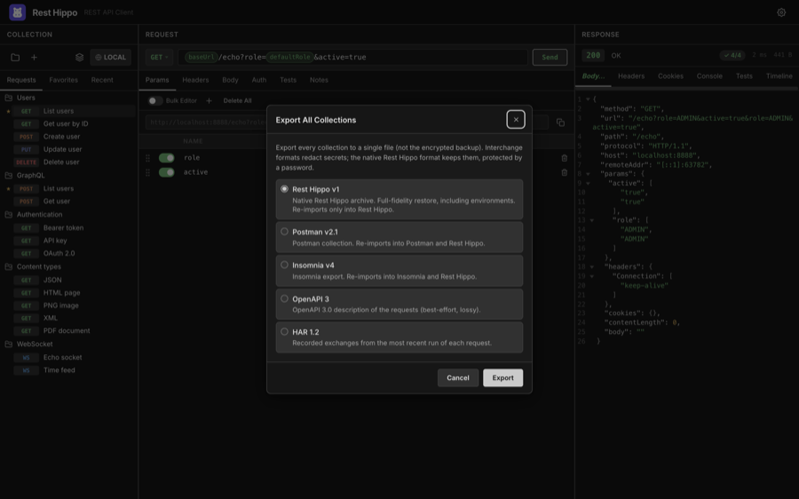
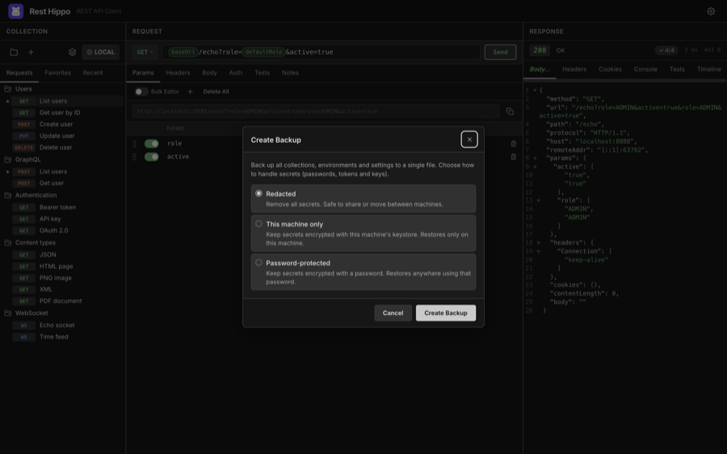

# Import, Export & Backup

[← Back to contents](README.md)

Rest Hippo can exchange collections with other tools and back up your entire
workspace. There are two separate features:

- **Import / Export** moves _collections_ in and out. The native **Rest Hippo
  v1** format is a lossless, full-fidelity archive (secrets kept,
  password-protected) that restores in place; the standard interchange formats
  (Postman, Insomnia, OpenAPI, HAR) are for sharing with other tools and
  **redact** secrets.
- **Backup / Restore** snapshots your _whole workspace_ — collections,
  environments, and settings — with a choice of how to handle secrets.

## Exporting

Export a single collection from its right-click menu (**Export…**), or export
everything at once — from the **File ▸ Export All Collections…** menu or the
export button in the [collections manager](collections.md) toolbar:



Choose a format:

| Format            | Notes                                                                                                  |
| ----------------- | ------------------------------------------------------------------------------------------------------ |
| **Rest Hippo v1** | Native, lossless archive. Restores everything exactly — including environments. Re-imports only into Rest Hippo. |
| **Postman v2.1**  | Postman collection. Re-imports into Postman and back into Rest Hippo.                                   |
| **Insomnia v4**   | Insomnia export. Re-imports into Insomnia and back into Rest Hippo.                                     |
| **OpenAPI 3**     | A best-effort, lossy OpenAPI 3.0 description of the requests.                                           |
| **HAR 1.2**       | Recorded request/response exchanges from recent runs.                                                  |

In the **interchange** formats (Postman, Insomnia, OpenAPI, HAR), secrets —
passwords, tokens, and keys — are **redacted**, so those exports are safe to
share. Rest Hippo then opens a native save dialog.

### The native Rest Hippo format

**Rest Hippo v1** is a full-fidelity archive meant for round-tripping your own
work — moving a collection between machines, or snapshotting it before a big
edit. Unlike the interchange formats, it keeps **everything** about the exported
requests: method, URL, query and path params, headers, the full **Auth**
configuration for every scheme, captures, scripts, notes, and bodies.

- **Variables travel referenced-only.** The archive adds an _environments_
  section (your environments and global variables) and the collection's own
  variables — but only the ones the exported requests actually reference
  (`{{name}}`, followed transitively). Anything unused is left out, so exporting a
  single folder never drags in the rest of the collection's variables (or forces a
  password for secrets it doesn't use). A folder's own variables always travel
  inside that folder.
- **Secrets are kept, not redacted.** If the exported set contains any secret it
  actually uses (an auth credential or a referenced `secure` variable with a
  value), Rest Hippo asks
  you to choose a password and encrypts those values into the file with the same
  scheme as a password-protected backup. With no secrets, there's no prompt and
  the file is plain JSON. **Treat a password-protected archive like a credential
  export** — anyone with the file _and_ the password can read its secrets.
- **Import merges in place.** Re-importing restores into your active collection
  rather than creating a duplicate: a folder that already exists (matched by id,
  then name) is reused and its contents restored into it; a request that already
  exists is **replaced** by the archived copy; anything new is created.
  Environments and variables are matched the same way and only _added_ when
  missing — an existing value is never overwritten. A password-protected archive
  prompts for its password on import.

## Importing

Open **File → Import Collection…** and pick a file. Rest Hippo recognizes the format
automatically:

- **Rest Hippo v1** native archives (`.json`) — merged in place (see above)
- **Postman** collections (`.json`)
- **Insomnia** exports (`.json` / `.yaml`)
- **OpenAPI 3** / Swagger 2.0 specifications (`.json` / `.yaml`)
- **HAR 1.2** captures (`.har`)

The file picker filters to these formats — `.json`, `.yaml` / `.yml`, and
`.har`. On macOS, hovering the **Import Collection…** menu item also shows this
list as a tooltip (native menu tooltips are a macOS-only feature, so on Windows
and Linux this page is the reference).

It reconstructs the folder structure, requests, headers, query, auth, and
variables, and adds them to your workspace as a new collection. A **HAR**
capture (a browser's "Save all as HAR", or a proxy export) is imported request
by request — grouped into a folder per host — so you can replay real traffic;
only the requests are imported, not the recorded responses.

**OpenAPI / Swagger** specs describe their operations as relative paths, so
importing one first asks for a **base-URL variable**: a name (default `baseUrl`)
and a value. Every imported request is prefixed with that variable — e.g.
`{{baseUrl}}/pets/{{petId}}` — so the host lives in one editable place. The value
is pre-filled from the spec's `servers` / `host` when it has one; otherwise leave
it blank and set it later in the collection's **Variables**.

### Import from cURL

To pull in a single request from a terminal, API docs, or a browser's **Copy as
cURL**, choose **File → Import from cURL…** and paste the command:

```
curl https://api.example.com/users \
  -H 'Authorization: Bearer ...' \
  -d '{"name":"Ada"}'
```

Rest Hippo parses the method, URL and query, headers, body (`-d` / `--data*`,
`--data-urlencode`, and `-F` form fields), and authentication — a `-u user:pass`
or an `Authorization: Bearer`/`Basic` header is lifted into the request's **Auth**
tab rather than left as a raw header. The result is added as a new collection,
ready to send.

> **Tip — paste a cURL straight onto a request.** You can also paste a `curl …`
> command directly into a request's **URL bar**. Rest Hippo recognizes it and rewrites
> that request to match the command (method, URL, params, headers, body, auth),
> instead of dropping the raw text into the field. A brand-new, empty request is
> updated in place; if the request already has content, Rest Hippo asks you to confirm
> before overwriting it.

### Import from a URL

When an OpenAPI or Swagger spec is published online, you don't have to download it
first — choose **File → Import from URL…** and paste the document's address:

```
https://api.example.com/openapi.json
```

Rest Hippo fetches the document through the desktop app's request engine (not the
browser), so there are no CORS limits, and a spec served from `http://localhost`
by a service running on your machine works just as well. If the document sits
behind a token, add the optional **Authorization header**: a bare value such as
`Bearer …` is sent as `Authorization`, or use a `Name: Value` line for a custom
header (e.g. `X-API-Key: …`). Once fetched, the import continues exactly like a
file import — including the **base-URL variable** prompt described above, whose
value is pre-filled with the host you imported from (so a spec with a relative
`servers` path still gets a complete, usable base URL). This entry imports
OpenAPI / Swagger documents; for other formats, download the file and use
**Import Collection…**.

## Backup & restore

A **backup** captures your complete workspace in one file. Open it from the
app's File menu (**Back up…** / **Restore…**).



When creating a backup, choose how secrets are handled:

| Mode                   | Secrets                                                                         | Restores on…                                      |
| ---------------------- | ------------------------------------------------------------------------------- | ------------------------------------------------- |
| **Redacted**           | Removed entirely                                                                | Anywhere — safe to share or move between machines |
| **This machine only**  | Kept in their at-rest encrypted form, tied to this machine's [Security](settings-and-themes.md#security) setup | Only this machine                                 |
| **Password-protected** | Encrypted with a password you choose                                            | Anywhere, with the password                       |

**Restoring** reads a backup file (prompting for the password if it's
password-protected) and lets you **Merge** it alongside your current collections
or **Replace** everything with the backup's contents.

> Use **This machine only** for routine local backups (no password to remember),
> and **Password-protected** when you need to move a full workspace — secrets and
> all — to another machine.

---

Next: [Settings & Themes →](settings-and-themes.md)
