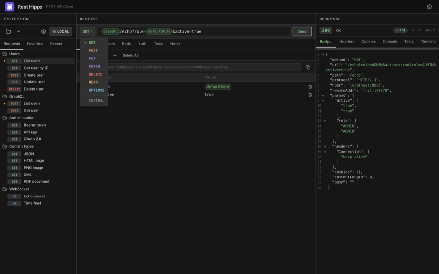
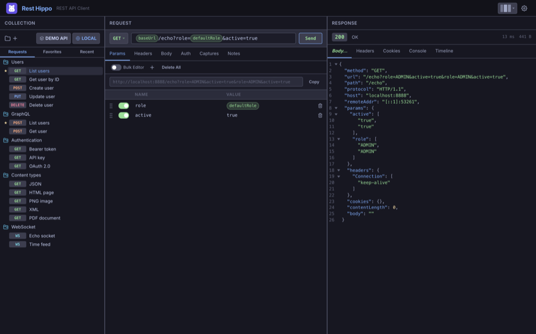
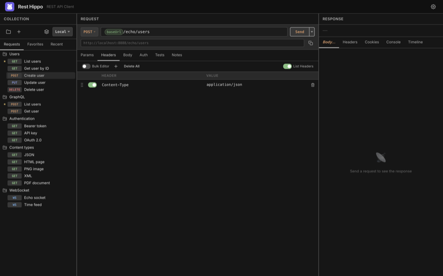
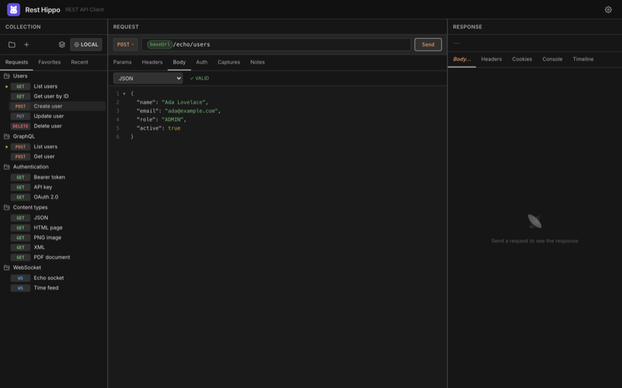
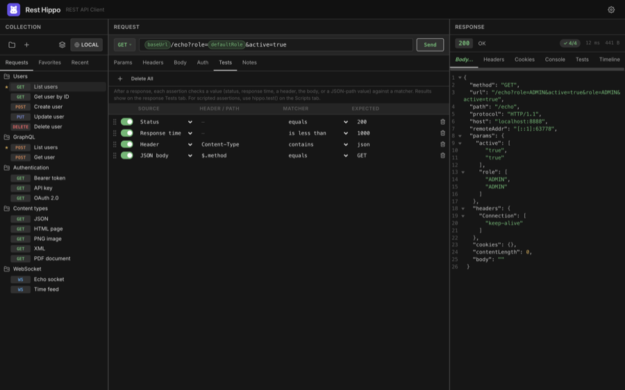

# Building Requests

[← Back to contents](README.md)

The center panel is the request editor. At the top is the **request bar** — the
method, the URL, and the **Send** button. Below it, a row of tabs lets you add
query parameters, headers, a body, authentication, and post-response captures.

> **Edits save automatically.** There is no Save button or shortcut — every change
> you make is written to disk a moment after you stop typing, so your work is
> always persisted and there's no unsaved state to lose.

## The request bar

### Method

Click the method button on the left to choose the HTTP verb:

Rest Hippo supports `GET`, `POST`, `PUT`, `PATCH`, `DELETE`, `HEAD`, `OPTIONS`, and a
**Custom…** option for any non-standard verb your API expects.

### URL

Type the request URL into the bar. You can drop
[`{{variables}}`](variables-and-environments.md) anywhere in it — for example
`{{baseUrl}}/users/{{userId}}`. When **Show URL preview** is on (Settings →
Appearance), Rest Hippo shows the fully-resolved URL beneath the params, so you can
confirm exactly what will be sent.

Press <kbd>Enter</kbd> in the URL bar to send the request, or click **Send**.
While a request is in flight the button becomes **Stop** — click it to abort.

### Send type

An icon to the right of the word **Send** shows how the button fires. Click the
caret beside it to open a menu of the three types (the active one is
check-marked); the choice is a global default that applies to every request:

| Type          | Icon              | Behavior                                                                                  |
| ------------- | ----------------- | ----------------------------------------------------------------------------------------- |
| **Immediate** | _(none)_          | Fires the request as soon as you trigger Send (the default).                               |
| **Delayed**   | stopwatch         | Waits the **Delay** you set, then fires once.                                              |
| **Interval**  | recycle arrows    | Waits the **Interval**, fires, then waits the interval again each time a response lands.     |

Choosing **Delayed** or **Interval** opens a small dialog under the Send button
with a single field for that type's timing — a delay for Delayed, an interval for
Interval. Defaults are a **5-second delay** and a **10-second interval**.

Every trigger — clicking **Send**, pressing <kbd>⌘/Ctrl</kbd>+<kbd>Enter</kbd>,
or double-clicking the request in the tree — runs the active type.

While a delayed or interval countdown is ticking, the button reads **Cancel**
and a colour sweep drains across it as the timer runs down; click it to cancel
the timer and return to **Send**. Switching to another request also stops the
countdown.

## Query parameters

The **Params** tab edits the query string as an editable key/value grid. Rest Hippo
keeps it in sync with the URL — editing one updates the other.

- Each row has an **enabled** toggle, a **name**, and a **value**. Disabled rows
  are kept but not sent.
- Both name and value accept `{{variables}}`.
- Use **+** to add a row, the trash icon to remove one, and **Delete All** to
  clear them.
- Toggle **Bulk Editor** to edit all parameters as plain text instead of rows —
  handy for pasting.

## Headers

The **Headers** tab works the same way — an enabled/name/value grid with a bulk
text mode.

As you type a header name, Rest Hippo suggests standard header names
(`Content-Type`, `Authorization`, `Accept`, …). Values accept `{{variables}}`.

> Some headers are managed for you. When you choose an
> [authentication](authentication.md) type, the matching `Authorization` (or
> custom) header is added automatically at send time.

## Request body

The **Body** tab lets you choose a body type from the dropdown and edit it:

| Body type            | Use it for                                                           |
| -------------------- | -------------------------------------------------------------------- |
| **No Body**          | `GET`/`HEAD` and other bodyless requests                             |
| **JSON**             | `application/json` payloads, with syntax highlighting and validation |
| **YAML**             | YAML payloads                                                        |
| **XML**              | XML payloads                                                         |
| **Plain Text**       | Any raw text                                                         |
| **Form Data**        | `multipart/form-data` — key/value fields, each **Text** or **File**  |
| **Form URL Encoded** | `application/x-www-form-urlencoded` key/value pairs                  |
| **GraphQL**          | A [GraphQL query + variables](graphql.md)                            |
| **File**             | Send a file's raw bytes as the body                                  |

For the structured editors (JSON / YAML / XML), Rest Hippo shows a **✓ VALID** /
**✗ INVALID** badge as you type. The code editor has line numbers and a resize
handle, and its right-click menu offers **Prettify** and **code folding**.
`{{variables}}` are highlighted inline and resolved at send time.

The **Form Data** and **Form URL Encoded** editors use the same key/value grid
as Params and Headers, with a bulk-text mode. In Form Data, switch a row between
**Text** and **File** to attach a file.

## Authentication & captures

Two more tabs round out the request:

- **[Auth](authentication.md)** — attach credentials (Bearer, OAuth 2.0, …).
- **[Captures](variables-and-environments.md#captures)** — pull values out of the
  response into variables for later requests.

There's also a **Notes** tab for free-form Markdown notes attached to the
request.

## Tests

The **Tests** tab attaches **assertions** that validate the response after every
send — a no-code way to turn a request into an API smoke test. (Enable it under
**Settings → Request → Show Tests tab**; it's off by default.)

Each row is one check:

- **Source** — what to look at: the **Status** code, the **Response time** (ms), a
  **Header**, the raw **Body**, or a **JSON body** value (give a path like
  `$.data.id` in the **Header / Path** column).
- **Matcher** — how to compare: **equals**, **does not equal**, **contains**,
  **does not contain**, **exists**, **does not exist**, **is less than**, **is
  greater than**, or **matches** (regular expression).
- **Expected** — the value to compare against (ignored for exists / does not
  exist).

Rows have the familiar enabled toggle, drag-to-reorder, and delete controls.
Results show on the response **[Tests](responses.md#tests)** tab with a pass/fail
badge, and are saved with each run so the **Timeline** shows whether a past run
passed. For checks that need logic, write
[`hippo.test()` assertions](scripting.md#test-assertions) on the Scripts tab —
they run alongside the grid and share the same Tests tab.

---

Next: [Authentication →](authentication.md)
