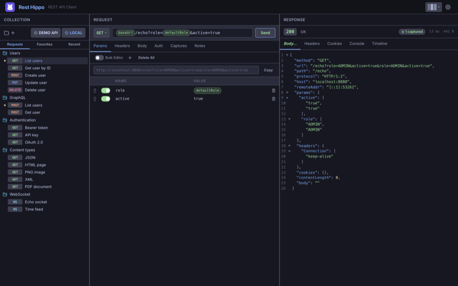
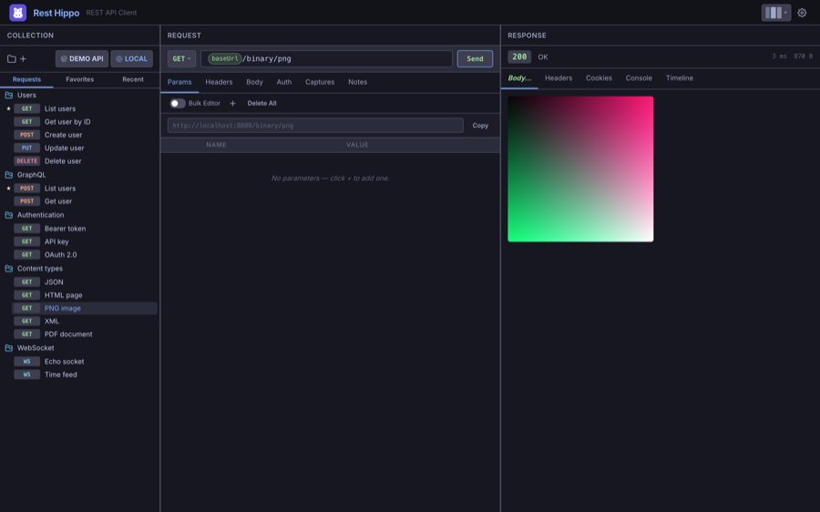
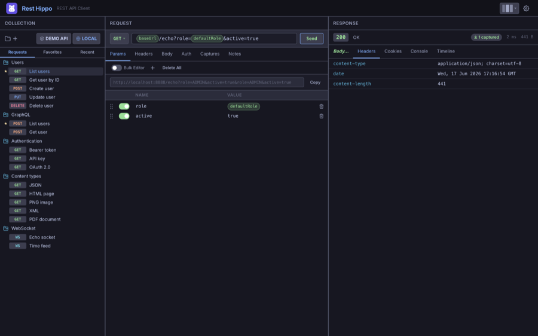
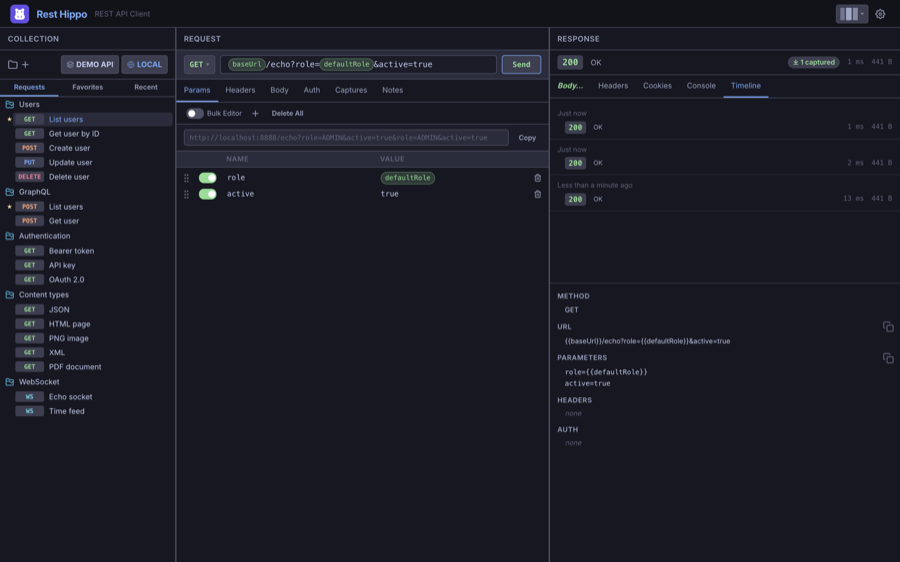
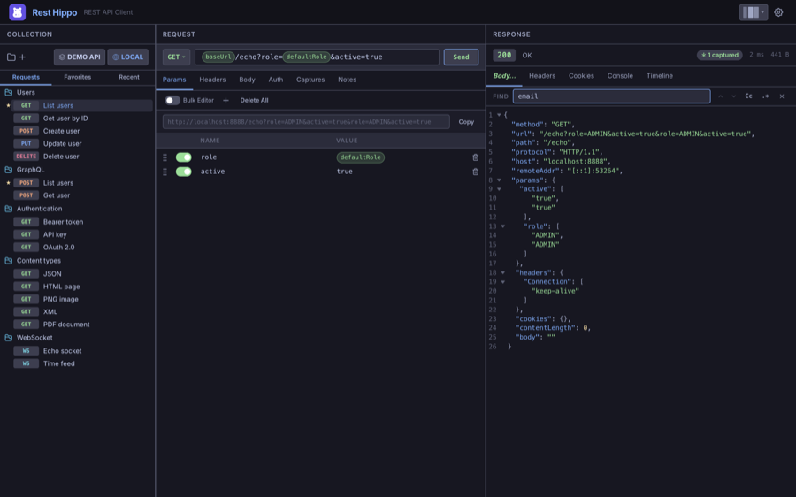

# Reading Responses

[← Back to contents](README.md)

When a request returns, the right panel fills in. The **status bar** at the top
shows the status code and text, the elapsed time, and the response size — plus a
**captured** badge if any [captures](variables-and-environments.md#captures) ran.

Below the status bar, a row of tabs organizes the response: **Body**,
**Preview**, **Headers**, **Cookies**, **Console**, and **Timeline**.

## Body

The **Body** tab renders the response according to its content type. By default
it's **Styled** — pretty-printed and syntax-highlighted:

- **JSON / YAML / XML / HTML** — indented and colorized
- **Markdown** — rendered
- **JavaScript / CSS** — colorized
- **Images** — shown inline:

  

- **Binary** — shown as a hex dump

**Secondary-click (right-click) the `Body` tab** for options: switch the render
mode between **Styled**, **Raw** (plain monospace), and **Hex**; **Copy** the
body; **Download** it (Rest Hippo picks an extension from the content type); or **Copy
as cURL** to reproduce the whole request on the command line.

### Preview

For HTML and Markdown responses, the **Preview** tab renders the content live in
a sandboxed view, so you can see the page as a browser would. Any `console.log`
output the page produces is captured on the **Console** tab.

> PDF responses open in Rest Hippo's built-in PDF viewer with zoom and page
> navigation.

## Streaming responses

Some endpoints send their body **incrementally** rather than all at once —
Server-Sent Events (`text/event-stream`), LLM token streams, and chunked logs.
Rest Hippo consumes these live: the **Body** tab becomes a timestamped, scrolling log
that fills as data arrives, instead of waiting for the response to finish.

- A response whose `Content-Type` is `text/event-stream` **streams
  automatically** — each SSE event appears as its own row as it is received,
  with named events (e.g. an LLM's `content_block_delta`) tagged for clarity.
- A response whose `Content-Type` is `application/x-ndjson` streams live too,
  but only when you enable **Stream NDJSON responses live** under **Settings →
  Request**. It is off by default, so a finite NDJSON document keeps the
  formatted **Body** view; turn it on to watch a live NDJSON feed line by line.
  While the setting is off and an NDJSON request is in flight, Rest Hippo shows a brief
  reminder over the loading view pointing you at the setting — handy when an
  endless feed would otherwise just sit and buffer. The reminder clears as soon
  as the request finishes.

While a stream is running the toolbar shows its live **state and an event/byte
counter**. You control the stream with the controls you already use elsewhere:

- **Stop** — the request editor's **Send** button becomes **Stop** for the whole
  duration of the stream, exactly like any other in-flight request. Click it to
  end the stream and abort the underlying request immediately.
- **Save** — right-click the response **Body** tab and choose **Download** to
  write the full stream to a file, including everything received so far on a
  stream that is still running or has been stopped.

The on-screen log is capped so a long-running (or never-ending) stream stays
memory-bounded; the complete stream is always available through the Body tab's
**Download** menu item.

The live log itself is session-scoped and isn't persisted, but **each streaming
run leaves a record in the [Timeline](#timeline)** — when it was sent, how long
it ran, how many events and bytes arrived, and the last few events received.
Reopening that record shows the summary in place of a body, so you can review a
past stream even though its full payload isn't kept.

## Headers

The **Headers** tab lists every response header as a name/value table:

## Cookies

The **Cookies** tab parses the response's `Set-Cookie` headers into a table —
name, value, domain, path, and the `Secure` / `HttpOnly` / `SameSite` / `Expires`
attributes. If the collection has [cookie sending](collections.md#cookies)
enabled, these cookies are stored and reused on later requests.

## Timeline

The **Timeline** tab keeps a short history of the request's recent runs. Each
entry records the status, timing, and a snapshot of what was sent — method, URL,
parameters, headers, and auth — so you can compare runs and reopen an earlier
response. [Streaming runs](#streaming-responses) appear here too, recorded as a
summary (duration, event/byte counts, and the last events) rather than a body:

How many runs are kept is configurable in
[Settings → History](settings-and-themes.md#history).

## Searching the body

Press <kbd>⌘/Ctrl</kbd>+<kbd>F</kbd> with the response focused to open the
**Find** bar:

- Type to highlight matches; the counter shows the active match and the total.
- <kbd>Enter</kbd> / <kbd>Shift</kbd>+<kbd>Enter</kbd> jump to the next/previous
  match.
- Toggle **case-sensitive** and **regex** matching.
- <kbd>Esc</kbd> closes the bar.

<kbd>⌘/Ctrl</kbd>+<kbd>A</kbd> selects the whole body text (when the find box
isn't focused).

---

Next: [Import, Export & Backup →](import-export-and-backup.md)
