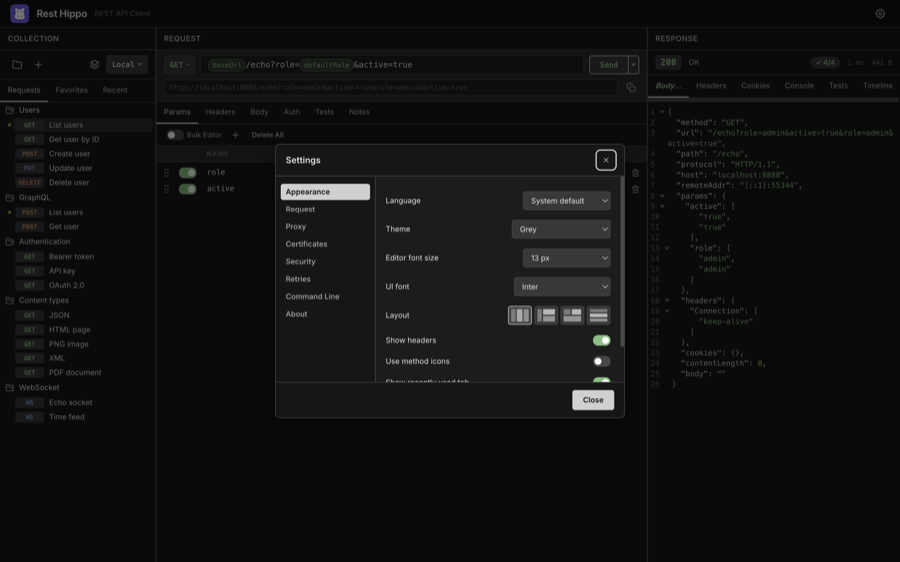
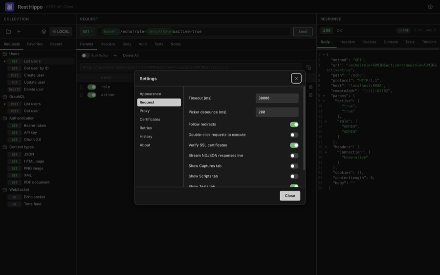
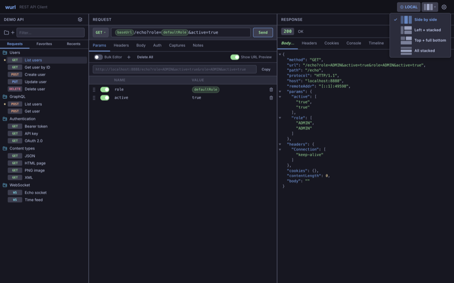

# Settings & Themes

[← Back to contents](README.md)

Open **Settings** from the ⚙ button in the header. Settings are grouped into
panels down the left side and **save as you change them** — there's no separate
save step.

## Appearance

| Setting              | What it does                                                                                                                                                 |
| -------------------- | ----------------------------------------------------------------------------------------------------------------------------------------------------------- |
| **Language**         | The interface language — **System** (follow the OS) or English, Deutsch, Español, Français, Italiano, 日本語, 中文（简体）. Changing it reloads the window. |
| **Theme**            | The color theme, plus the **Theme Editor…** entry (see [Themes](#themes)).                                                                                   |
| **Editor font size** | Size of text in the code editors (11, 12, 13, 14, 16, or 18 px).                                                                                            |
| **UI font**          | The interface typeface — **Inter** (bundled), your **system** font, or SF Pro / Segoe UI / Ubuntu / Roboto.                                                  |
| **Layout**           | The [panel layout](#layouts) (1–4).                                                                                                                          |
| **Hide headers**     | Hides the top header bar and moves its controls into the collections panel, for a more compact window.                                                       |
| **Use method icons** | Show HTTP method badges as compact icons instead of text.                                                                                                    |
| **Show recently used tab** | Show or hide the [Recent](collections.md#favorites-and-recent) tab.                                                                                    |
| **Show URL preview** | Show the resolved URL (with `{{variables}}` filled in) above the Params editor.                                                                              |

You can change the editor font size anywhere with <kbd>⌘/Ctrl</kbd>+<kbd>+</kbd> /
<kbd>-</kbd> / <kbd>0</kbd>. **Code folding** is toggled from each editor's own
right-click menu rather than from Settings.

## Request

| Setting                              | What it does                                                                                                                                             |
| ------------------------------------ | -------------------------------------------------------------------------------------------------------------------------------------------------------- |
| **Timeout (ms)**                     | How long to wait before giving up on a request.                                                                                                          |
| **Picker debounce (ms)**             | Delay before the `{{` typeahead appears.                                                                                                                 |
| **Follow redirects**                 | Automatically follow 3xx redirects.                                                                                                                      |
| **Double-click requests to execute** | Double-clicking a request in the tree loads _and_ sends it.                                                                                              |
| **Verify SSL certificates**          | Reject invalid/self-signed certificates. Turn off to test against dev servers.                                                                           |
| **Show Captures tab**                | Show the **Captures** tab on the request editor. When off, the tab is hidden _and_ capture rules are not run after a response. Off by default.           |
| **Show Scripts tab**                 | Show the **Scripts** tab on the request editor. When off, the tab is hidden _and_ pre-request / after-response scripts are not executed. Off by default. |
| **Show Tests tab**                   | Show the **Tests** tab on the request editor. When off, the tab is hidden _and_ no-code assertions are not run after a response. Off by default.         |
| **Show Notes tab**                   | Show the **Notes** tab on the request editor. On by default.                                                                                             |

## Proxy

Route requests through an HTTP/HTTPS or SOCKS proxy. Enter a **Proxy URL** (the
scheme — `http://`, `socks5://`, … — selects the proxy type), optionally enable
**proxy authentication** with a username and password, and list hosts to
**bypass** (a `NO_PROXY`-style list supporting suffixes and `*` globs).

## Certificates

Configure mutual TLS (mTLS) and custom trust for hosts that need more than the
system certificate store.

- **Client certificates** — present a certificate to hosts that require mutual
  TLS. Each entry has a **Host** pattern (exact, suffix, or `*` glob, with an
  optional `:port`, matched like the proxy bypass list) and a **Format**: choose
  **PEM** to point at a certificate file plus an optional private-key file, or
  **PFX / P12** for a single bundle. A **passphrase** can be supplied for an
  encrypted key or PFX. The first entry whose host matches a request wins, so
  list a specific host above a broader wildcard. The certificate is also
  presented automatically on redirects to a matching host and on OAuth token
  requests to one.

- **Certificate authorities** — add CA files to trust **in addition to** the
  system roots. This lets a privately-signed host validate with verification
  still on, instead of turning verification off globally.

- **Skip verification for hosts** — a `NO_PROXY`-style list of hosts whose TLS
  certificate is not checked. Use this only for trusted self-signed hosts when a
  custom CA isn't practical; it overrides the global **Verify SSL** toggle for
  those hosts only.

Only file **paths** are stored — Rest Hippo reads the certificate bytes in the
background process when a request is sent. Passphrases are encrypted at rest using
the secret-storage method chosen under **Security** (like all other secrets) and
are removed from secret-free exports.

## Security

Choose how Rest Hippo encrypts your secrets — auth passwords and tokens, OAuth
client secrets, proxy credentials, mTLS passphrases, and variables marked
**secure** — at rest on this device. Switching re-encrypts every stored secret;
the change applies after a quick reload.

- **This device (no prompt)** — the default. Secrets are encrypted with a random
  key kept in a protected file on this device, so there are **no system prompts**.
  The trade-off: the key sits alongside your data, so anyone who can read this
  computer's files could read your secrets. (On Windows and on Linux without a
  keyring, the OS-keychain option falls back to this behaviour.)

- **OS keychain** — secrets are encrypted with your operating system's keychain
  (macOS Keychain, Windows Credential Manager, Linux Secret Service). This is the
  strongest at-rest protection, but the OS may show an access prompt.

- **Master password** — secrets are encrypted with a password you choose. On each
  launch they start **locked**; enter the password once per session to unlock
  them (a locked secret shows an **Unlock** link where it's used). If you forget
  the password, the secrets **cannot be recovered**.

Existing installs keep using the OS keychain until you switch here; new installs
default to **This device**. Switching to or from **OS keychain** may show one
system prompt during the re-encryption.

Note: only secret _values_ are encrypted. Execution history, response bodies, and
the cookie jar are stored unencrypted in every mode.

## Retries

Automatically retry failed requests with backoff. Configure the **max
attempts**, the **backoff base**, **multiplier**, and **max delay**, and choose
what to retry on — **connection errors**, **timeouts**, and/or a list of
**status codes** (e.g. `429, 503, 504`). Retries are off by default.

When a retried response carries a **`Retry-After`** header, Rest Hippo waits for
the time the server asks (capped at your **max delay**) instead of the computed
backoff. To avoid duplicating a write, **connection-error and timeout** retries
apply only to idempotent methods (GET, HEAD, PUT, DELETE, …) — a `POST`/`PATCH`
that fails mid-flight might already have been processed, so it is **not** retried
on a network error unless you enable **Retry POST/PATCH on network errors**.
(Status-code retries still apply to every method, since the server's response
shows it didn't act on the request.)

## History

Set how many runs each request keeps in its
[**Timeline**](responses.md#timeline) (1–10).

## Command Line

The **Command Line** panel installs a `hippo` command so you can launch Rest
Hippo from a terminal — the equivalent of VS Code's "Install `code` command in
PATH". Click **Install** and afterwards typing `hippo` in any terminal opens Rest
Hippo (or focuses it if it's already running); click **Remove** to undo it.

The first time you start a freshly installed copy, Rest Hippo also offers to set
this up for you — you can decline and install it later from here.

How it works per platform:

- **macOS / Linux** — a small launcher script is written to `/usr/local/bin`
  when that's writable, otherwise to `~/.local/bin`. If the fallback location
  isn't already on your `PATH`, Rest Hippo tells you so you can add it.
- **Windows** — a `hippo.cmd` shim is created and its folder is added to your
  per-user `PATH`. Open a **new** terminal afterwards to pick up the change.

> The command is only available in the installed app — it's disabled when running
> a development build, since there's no packaged executable to point at.

## About & updates

The **About** panel shows the installed version, an **Automatically check for
updates** toggle, and a **Check for Updates** button. Automatic checking is
**off by default**: enable the toggle to have Rest Hippo look for new releases
shortly after launch. The **Check for Updates** button — and **Help → Check for
Updates…** — run on demand regardless of the toggle.

When a newer release is found it downloads in the background; once it's ready a
notification offers to **Restart** and install it — Rest Hippo never restarts on
its own. Updates are signed, so they install without security prompts.

## Layouts

The **layout picker** in **Appearance → Layout** rearranges the three panels
into four configurations — click a layout icon to switch:

| Layout                | Arrangement                                                  |
| --------------------- | ------------------------------------------------------------ |
| **Side by side**      | Collections │ Request │ Response, in three columns           |
| **Left + stacked**    | Collections on the left; Request above Response on the right |
| **Top + full bottom** | Collections and Request on top; Response full-width below    |
| **All stacked**       | The three panels stacked top to bottom                       |

Rest Hippo also adapts automatically to narrow windows, and remembers where you drag
the panel dividers.

## Themes

Rest Hippo ships with four built-in themes — **Mocha** (the default dark theme),
**Grey dark**, **Latte** (light), and **Grey light** — selectable from
**Appearance → Theme**.

For full control, choose **Theme Editor…** from the theme dropdown to open the
editor in its own window. It has two tabs:

- **Colors** — tune every colour token: backgrounds, text, accent and semantic
  colours, plus the per-method request badges.
- **Metrics** — adjust the layout tokens that control how dense the interface
  feels: the **spacing** scale, **control heights** (buttons, inputs, selects),
  corner **radii**, and the **splitter** thickness. Each is a pixel value.

Both tabs update the app with a **live preview**, so you can see your changes as
you make them. Save your creation as a custom theme that appears in the theme
list. Custom themes can be exported and imported to share.

> The interface font for **context menus** always uses your OS's native
> typeface (San Francisco, Segoe UI, …); the **UI font** setting controls
> everything else.

---

Next: [Keyboard Shortcuts →](keyboard-shortcuts.md)
