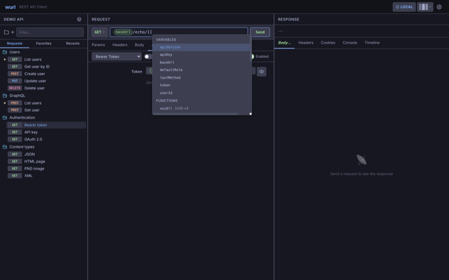
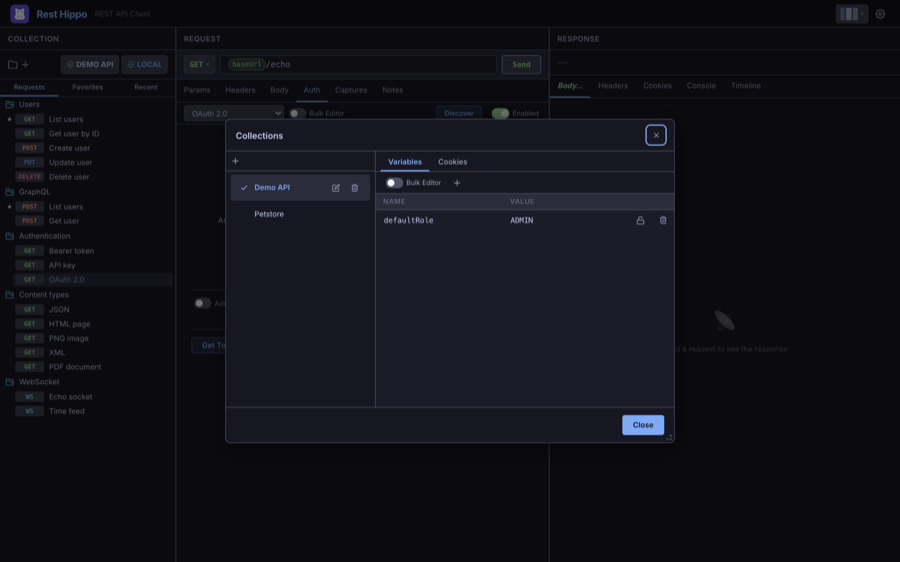
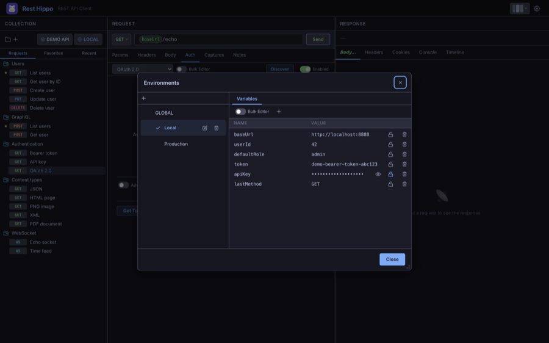
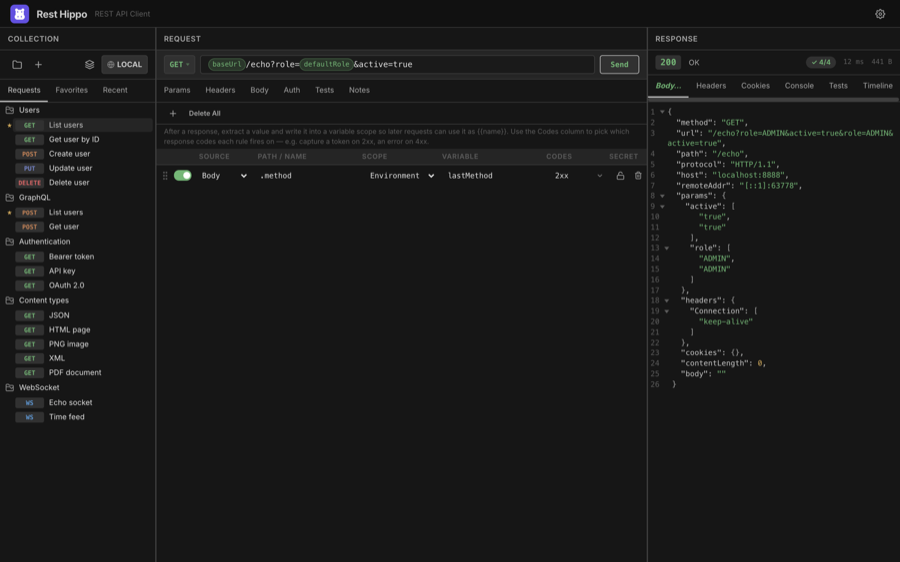

# Variables & Environments

[← Back to contents](README.md)

Variables let you write a request once and reuse it across hosts, users, and
runs. Anywhere you can type — the URL, params, headers, body, or auth fields —
you can insert a variable with double-brace syntax: `{{name}}`.

## Using variables

Type `{{` in any field to open the **typeahead**, which lists the variables
available in the current scope. Pick one and Rest Hippo inserts it as a highlighted
**pill**:



At send time, every `{{name}}` is replaced with its resolved value. With
[**Show URL preview**](requests.md#url) on, you can see the resolved URL before
you send.

## Scopes

A variable can be defined at four levels. When the same name exists in more than
one, the **most specific scope wins**:

```
Folder  ▸  Collection  ▸  Environment  ▸  Global
(most specific)                        (most general)
```

- **Global** — available everywhere, in every collection.
- **Environment** — defined in the active environment (see below). Switching
  environments swaps these values.
- **Collection** — defined on a collection, shared by every request in it.
- **Folder** — defined on a folder, scoped to the requests inside it.

So a `baseUrl` set in your **Local** environment overrides a global `baseUrl`,
and a folder-level override beats them both.

### Collection variables

Open the [Collections manager](collections.md#collections) and use the
**Variables** tab to edit a collection's variables:



Folder variables work the same way — right-click a folder and choose
**Variables**.

## Environments

An **environment** is a named set of variables you can switch between — the
classic use is one environment per deployment (Local, Staging, Production), each
with its own `baseUrl`, credentials, and IDs.

Click the **environment picker** in the collections toolbar (it shows the active
environment, e.g. `LOCAL`) to open a quick-switch menu. It lists **Global**
followed by every named environment, with a check beside the active one — pick
one to **make it active** instantly (all `{{variables}}` resolve against it).
To **add, rename, delete, or edit** environments you must **right-click** the
picker: that opens the same menu plus a **Manage…** entry, which opens the full
environments editor. (A plain click only switches the active environment — it
never opens the editor.)



- **Global** is always first; its variables are available everywhere.
- Below it are your named environments. Click one to **make it active** — a
  check marks the active environment, and all `{{variables}}` resolve against it.
- **+** adds an environment; drag to reorder; double-click to rename; the trash
  icon deletes.
- The **Variables** tab on the right edits the selected environment's variables
  as a key/value grid (or as plain text via **Bulk editor**). Changes save
  automatically.

### Secure variables

Mark a variable **secure** (the lock icon) to **encrypt it at rest** and mask it
in the UI. Revealed secrets re-mask themselves automatically after a short time.
Use secure variables for tokens and passwords you reference from
[auth fields](authentication.md).

## Captures

Captures close the loop: after a request succeeds, pull a value **out** of the
response and write it into a variable that later requests can use. A login
request can capture the returned token; the next request sends it as a Bearer
token — no copy-paste.

Configure them on the **Captures** tab of the request:



Each capture rule has:

| Field           | Meaning                                                                |
| --------------- | ---------------------------------------------------------------------- |
| **Source**      | Where to read from: the **Body**, a **Header**, or the **Status** code |
| **Path / Name** | For Body, a dot-path like `.data.token`; for Header, the header name   |
| **Scope**       | Where to write: **Environment**, **Collection**, or **Global**         |
| **Variable**    | The variable name to write                                             |
| **Codes**       | Which response codes the rule fires on (see below)                     |
| **Secret**      | Mark the captured value secure (encrypted, masked)                     |

For the **Body** source the same dot-path (`.data.token`, `.items.[0].id`)
works whether the response is **JSON**, **YAML**, or **XML** — the body is
parsed automatically and the path is walked over it. XML is addressed from its
root element (e.g. `<auth><token>…</token></auth>` → `.auth.token`), and
repeated tags become an indexable list (`.list.item.[0]`). A body that isn't one
of those formats, or a path that finds nothing, is reported as a warning and
captures nothing.

### Choosing which response codes a rule fires on

Each rule has its own **Codes** selector — click it to open a checklist where you
can tick whole status **groups** (`1xx`–`5xx`), choose **Any status**, or type
**specific codes** (e.g. `201`, `404`) that appear as removable chips. A rule
runs only when the response status matches its selector, so a single request can
capture different values into different variables depending on the outcome — for
example capture the access token from a `2xx` body into `token`, but capture the
error message from a `4xx` body into `lastError`.

New rules default to **2xx**, so captures keep firing only on success unless you
opt a rule into other codes. When a value can't be found (missing field, empty
body) the rule is reported as a warning and never overwrites a good value with an
empty one.

Rest Hippo shows a small toast confirming what was written (e.g. _Captured 1
variable → env.token_), and the response status bar shows a **captured** badge.

---

Next: [Functions →](functions.md)
