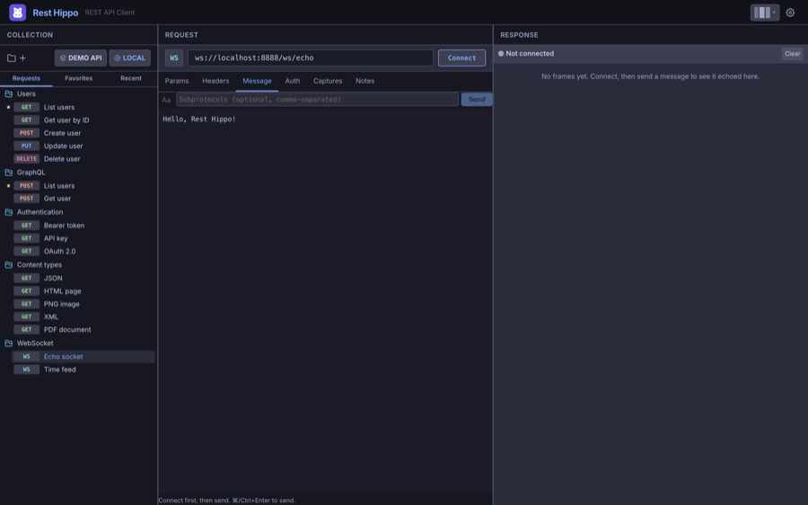
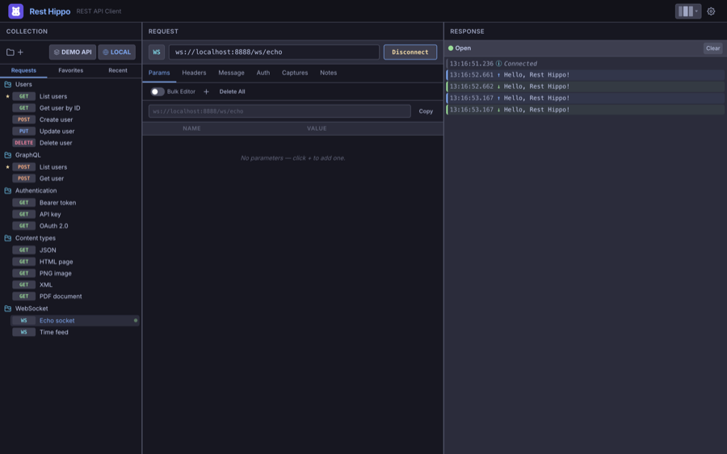

# WebSockets

[← Back to contents](README.md)

wurl is also a WebSocket client. Create a WebSocket request from the tree
(right-click a folder → **Add WebSocket Request**, or right-click the **+**
button above the tree and choose **Add WebSocket Request**), and point it at a
`ws://` or `wss://` URL.

## The WebSocket editor

A WebSocket request looks much like an HTTP one, but the request bar shows a
**WS** label and a **Connect** button, and the body is replaced by a **Message**
composer:

- **Message** — the frame you'll send. Toggle the format between **Text** (`Aa`)
  and **JSON** (`{ }`); JSON messages support `{{variables}}`.
- **Subprotocols** — an optional comma-separated list offered during the
  handshake.
- **Params**, **Headers**, and **Auth** apply to the opening handshake, just as
  they do for HTTP requests.

## Connecting and sending

Click **Connect** to open the socket. The status indicator shows the connection
state — _Connecting…_, **Open**, _Closing…_, **Closed**, or **Error** — and the
button becomes **Disconnect**.

Once connected, edit your message and click **Send** (or press
<kbd>⌘/Ctrl</kbd>+<kbd>Enter</kbd>). Every frame is logged in the **frame log**
on the right:

The frame log is a timestamped record of the whole session:

- **Sent** frames (outgoing messages),
- **Received** frames (incoming data — including server pushes you didn't ask
  for), and
- **System** frames (lifecycle events: _Connected_, _Disconnected_, errors).

JSON payloads are pretty-printed automatically. Use **Clear** to reset the log;
it also clears when you disconnect.

> A failed handshake (for example a `401` rejection) surfaces in the log as an
> **Error** frame with the status, so you can tell a refused upgrade from a
> dropped connection.

---

Next: [Reading Responses →](responses.md)
